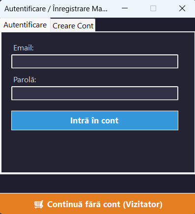
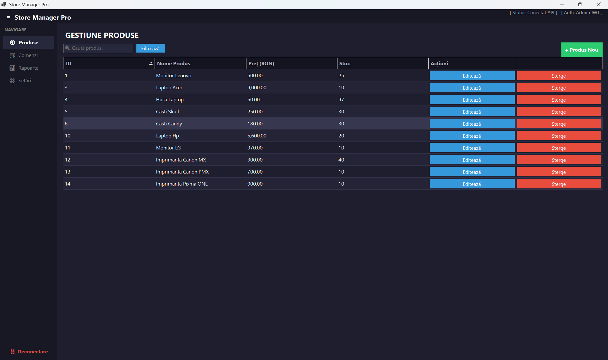
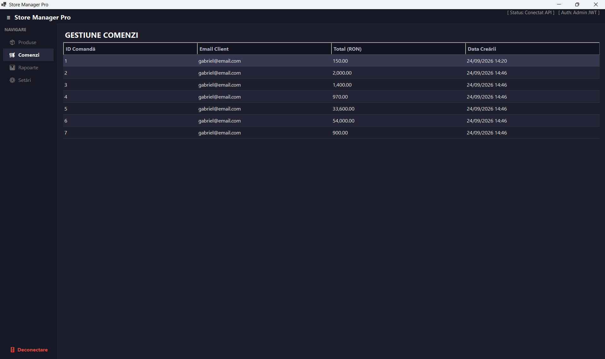
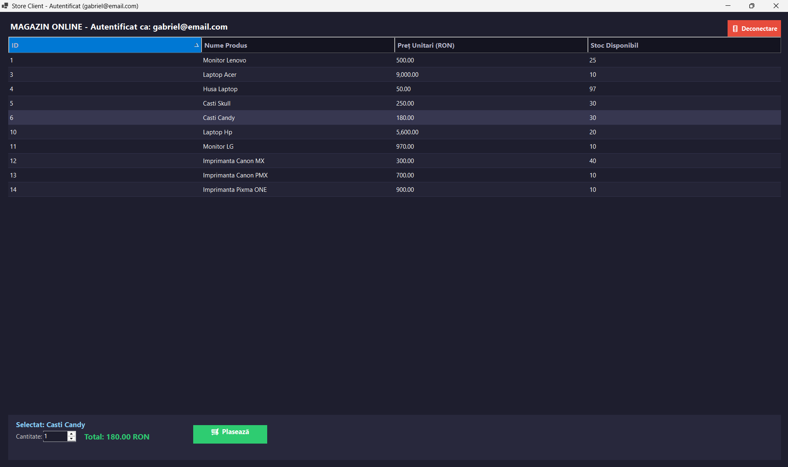
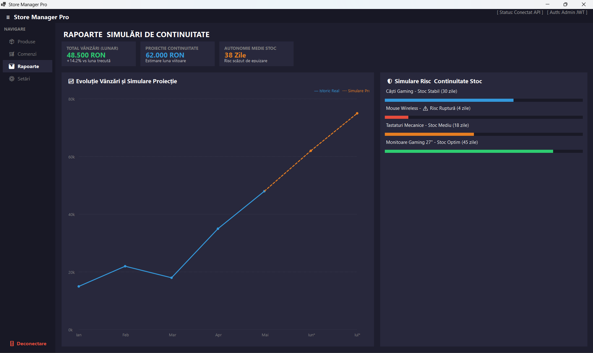
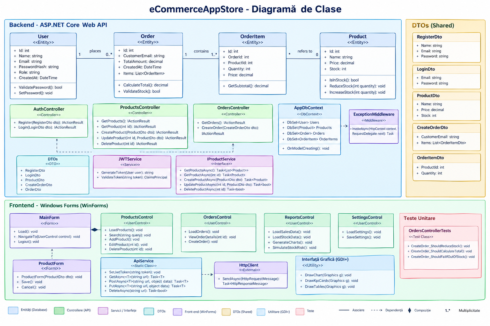
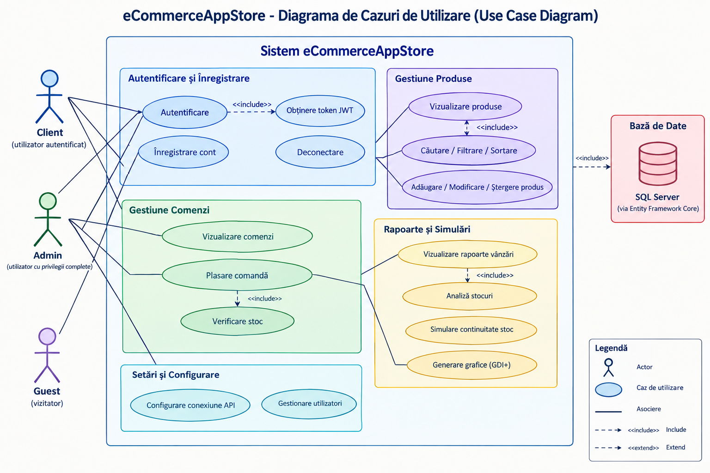
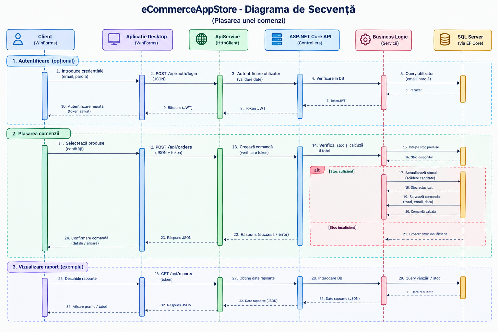

# 🛒 Store Manager Pro / eCommerceAppStore

Sistem **Full-Stack pentru gestiunea unui magazin online**, dezvoltat în **C# și .NET**, format dintr-un backend REST API bazat pe **ASP.NET Core** și o aplicație desktop realizată în **Windows Forms (WinForms)**.

Aplicația permite administrarea produselor și comenzilor, autentificarea utilizatorilor pe bază de **JWT**, gestionarea stocurilor, plasarea comenzilor și vizualizarea unor rapoarte privind vânzările și continuitatea stocurilor.

---

## 📑 Cuprins

* [📌 Despre Proiect](#-despre-proiect)
* [🏗️ Arhitectura Sistemului](#️-arhitectura-sistemului)
* [✨ Funcționalități Principale](#-funcționalități-principale)
* [🛡️ Autentificare și Securitate](#️-autentificare-și-securitate)
* [📦 Gestiune Produse](#-gestiune-produse)
* [🛒 Gestiune Comenzi](#-gestiune-comenzi)
* [📊 Rapoarte și Simulări](#-rapoarte-și-simulări)
* [🛠️ Stack Tehnologic](#️-stack-tehnologic)
* [📡 API REST](#-api-rest)
* [🗄️ Baza de Date](#️-baza-de-date)
* [🖥️ Interfață Grafică](#️-interfață-grafică)
* [🧪 Testare](#-testare)
* [📁 Structura Proiectului](#-structura-proiectului)
* [⚙️ Cerințe Sistem](#️-cerințe-sistem)
* [🚀 Instalare și Rulare](#-instalare-și-rulare)

---

# 📌 Despre Proiect

**Store Manager Pro** este o aplicație de gestiune destinată unui magazin online.

Sistemul este împărțit în două componente principale:

### 🔹 Backend — ASP.NET Core Web API

Backend-ul este responsabil pentru:

* gestionarea produselor;
* gestionarea comenzilor;
* verificarea și actualizarea stocurilor;
* persistarea datelor în baza de date;
* autentificarea utilizatorilor;
* autorizarea pe baza rolurilor;
* generarea token-urilor JWT;
* validarea datelor primite;
* tratarea centralizată a excepțiilor.

### 🔹 Frontend — Windows Forms

Aplicația desktop oferă interfața grafică pentru:

* autentificare și înregistrare;
* administrarea produselor;
* vizualizarea comenzilor;
* plasarea comenzilor;
* vizualizarea rapoartelor;
* configurarea conexiunii către API.

Comunicarea dintre aplicația desktop și backend se realizează prin **HTTP și REST API**.

---

# 🏗️ Arhitectura Sistemului

```text
                    ┌─────────────────────────┐
                    │       WinForms          │
                    │    Desktop Client       │
                    │                         │
                    │  • Login / Register     │
                    │  • Products             │
                    │  • Orders               │
                    │  • Reports              │
                    │  • Settings             │
                    └────────────┬────────────┘
                                 │
                              HTTP/JSON
                                 │
                                 ▼
                    ┌─────────────────────────┐
                    │    ASP.NET Core API     │
                    │                         │
                    │  • Controllers          │
                    │  • DTOs                 │
                    │  • JWT Authentication   │
                    │  • Middleware           │
                    │  • Business Logic       │
                    └────────────┬────────────┘
                                 │
                          Entity Framework Core
                                 │
                                 ▼
                    ┌─────────────────────────┐
                    │       SQL Server        │
                    │                         │
                    │  • Products             │
                    │  • Orders               │
                    │  • Users                │
                    └─────────────────────────┘
```

---

# ✨ Funcționalități Principale

## 🛡️ Autentificare

Aplicația oferă un sistem de autentificare bazat pe **JWT Bearer Tokens**.

Sunt disponibile:

* autentificare cu email și parolă;
* creare cont nou;
* generare token JWT;
* transmiterea token-ului către API;
* deconectarea utilizatorului;
* suport pentru roluri diferite.

### Roluri

| Rol      | Acces                                               |
| -------- | --------------------------------------------------- |
| `Admin`  | Administrarea produselor, comenzilor și rapoartelor |
| `Client` | Vizualizarea produselor și plasarea comenzilor      |
| `Guest`  | Acces limitat fără autentificare                    |

---

# 🛡️ Autentificare și Securitate

Interfața de autentificare permite utilizatorului să introducă:

* Email
* Parolă

După autentificare, backend-ul generează un **JWT Token**, iar aplicația desktop îl utilizează pentru cererile către endpoint-urile protejate.



### Înregistrare

Pentru crearea unui cont sunt disponibile câmpurile:

* Nume complet;
* Email;
* Parolă.

Datele sunt transmise către endpoint-ul de înregistrare al API-ului.


### Autorizare

Accesul la anumite operații este controlat prin roluri.

De exemplu, operațiile de administrare a produselor sunt disponibile utilizatorilor cu rol de `Admin`.

---

# 📦 Gestiune Produse

Modulul **Produse** permite administratorului să gestioneze catalogul magazinului.

Funcționalitățile disponibile sunt:

* afișarea produselor;
* căutarea produselor;
* filtrarea produselor;
* sortarea;
* adăugarea unui produs;
* modificarea unui produs;
* ștergerea unui produs;
* vizualizarea prețului;
* vizualizarea stocului.

Tabelul produselor conține:

| Câmp        | Descriere              |
| ----------- | ---------------------- |
| ID          | Identificator unic     |
| Nume Produs | Denumirea produsului   |
| Preț        | Prețul în RON          |
| Stoc        | Cantitatea disponibilă |
| Acțiuni     | Editare / Ștergere     |

La ștergerea unui produs este solicitată confirmarea utilizatorului.

---



# 🛒 Gestiune Comenzi

Modulul **Comenzi** permite administratorului să vizualizeze comenzile existente.

Pentru fiecare comandă sunt afișate:

* ID-ul comenzii;
* email-ul clientului;
* valoarea totală;
* data creării.

Exemplu de structură:

| ID Comandă | Email Client                                | Total (RON) | Data Creării |
| ---------: | ------------------------------------------- | ----------: | ------------ |
|          1 | [client@email.com](mailto:client@email.com) |      150.00 | 24/09/2026   |
|          2 | [client@email.com](mailto:client@email.com) |    2,000.00 | 24/09/2026   |

La plasarea unei comenzi, backend-ul:

1. verifică existența produsului;
2. verifică disponibilitatea stocului;
3. calculează valoarea totală;
4. scade cantitatea comandată din stoc;
5. salvează comanda;
6. memorează momentul creării comenzii.

---



# 🛍️ Interfața Clientului

Utilizatorii autentificați ca **Client** pot vizualiza produsele disponibile.

Pentru fiecare produs sunt afișate:

* ID;
* nume;
* preț unitar;
* stoc disponibil.

După selectarea unui produs, clientul poate introduce cantitatea dorită.

Interfața calculează automat totalul:

```text
Total = Preț unitar × Cantitate
```

Comanda este transmisă către backend prin endpoint-ul REST corespunzător.



---

# 📊 Rapoarte și Simulări

Modulul **Rapoarte** oferă administratorului o vedere de ansamblu asupra activității magazinului.

Sunt disponibile mai multe elemente de analiză:

### 💰 Total vânzări

Afișează valoarea totală a vânzărilor pentru perioada analizată.

### 📈 Proiecție continuitate

Prezintă o estimare a vânzărilor pentru perioada următoare.

### 📦 Autonomie medie stoc

Estimează numărul de zile în care stocul disponibil poate susține vânzările.

### ⚠️ Simulare risc stoc

Produsele sunt analizate în funcție de autonomia estimată a stocului.

Exemplu:

```text
Căști Gaming       → Stoc Stabil
Mouse Wireless     → Risc Ruptură
Tastaturi Mecanice → Stoc Mediu
Monitoare Gaming   → Stoc Optim
```

---




# 📈 Grafice

Rapoartele includ un grafic pentru evoluția vânzărilor.

Graficul prezintă:

* istoricul real;
* valorile lunare;
* proiecția pentru lunile următoare.

Graficul este realizat folosind **GDI+ / System.Drawing**, fără utilizarea unei biblioteci externe de charting.

---

# 🛠️ Stack Tehnologic

| Componentă       | Tehnologie            |
| ---------------- | --------------------- |
| Limbaj           | C#                    |
| Framework        | .NET                  |
| Backend          | ASP.NET Core Web API  |
| ORM              | Entity Framework Core |
| Bază de date     | SQL Server            |
| Frontend         | Windows Forms         |
| Comunicare       | HTTP / REST / JSON    |
| Autentificare    | JWT Bearer            |
| Documentație API | Swagger / OpenAPI     |
| Grafică          | GDI+ / System.Drawing |
| Testing          | xUnit                 |
| Test DB          | EF Core In-Memory     |

---

# 📡 API REST

Backend-ul expune endpoint-uri REST pentru comunicarea cu aplicația desktop.

## 🔐 Autentificare

| Metodă | Rută                 | Acces  | Descriere                     |
| ------ | -------------------- | ------ | ----------------------------- |
| `POST` | `/api/auth/register` | Public | Creare cont                   |
| `POST` | `/api/auth/login`    | Public | Autentificare și generare JWT |

---

## 📦 Produse

| Metodă   | Rută                 | Acces           | Descriere         |
| -------- | -------------------- | --------------- | ----------------- |
| `GET`    | `/api/products`      | Public / Bearer | Preluare produse  |
| `GET`    | `/api/products/{id}` | Public / Bearer | Produs după ID    |
| `POST`   | `/api/products`      | Admin           | Adăugare produs   |
| `PUT`    | `/api/products/{id}` | Admin           | Modificare produs |
| `DELETE` | `/api/products/{id}` | Admin           | Ștergere produs   |

Endpoint-ul de listare suportă operații precum:

* căutare;
* filtrare după preț;
* filtrare după stoc;
* sortare;
* paginare.

---

## 🛒 Comenzi

| Metodă | Rută          | Acces          | Descriere        |
| ------ | ------------- | -------------- | ---------------- |
| `GET`  | `/api/orders` | Admin          | Lista comenzilor |
| `POST` | `/api/orders` | Client / Admin | Creare comandă   |

---

# 🗄️ Baza de Date

Aplicația utilizează **Entity Framework Core** pentru accesul la baza de date.

## Product

Entitatea `Product` conține:

| Proprietate | Tip       | Descriere              |
| ----------- | --------- | ---------------------- |
| `Id`        | `int`     | Primary Key            |
| `Name`      | `string`  | Numele produsului      |
| `Price`     | `decimal` | Prețul produsului      |
| `Stock`     | `int`     | Cantitatea disponibilă |

Constrângerile definite pentru produs includ:

* nume obligatoriu;
* maximum 20 de caractere pentru nume;
* preț între `0.01` și `100000`;
* stoc între `0` și `10000`;
* preț stocat cu precizie `decimal(18,2)`.

---

## Order

Entitatea `Order` conține:

| Proprietate     | Tip        | Descriere           |
| --------------- | ---------- | ------------------- |
| `Id`            | `int`      | Primary Key         |
| `CustomerEmail` | `string`   | Email client        |
| `TotalAmount`   | `decimal`  | Valoarea comenzii   |
| `CreatedAt`     | `DateTime` | Data și ora creării |

Data creării este memorată în format UTC.

---

# ⚙️ Middleware

Aplicația utilizează un middleware global pentru tratarea excepțiilor.

Fișier:

```text
ExceptionMiddleware.cs
```

În cazul unei excepții neprevăzute, middleware-ul returnează un răspuns JSON standardizat cu status:

```text
500 Internal Server Error
```

Astfel, tratarea erorilor este centralizată la nivelul aplicației API.

---

# 🔌 Comunicarea dintre Frontend și Backend

Comunicarea este centralizată în:

```text
ApiService.cs
```

Serviciul utilizează:

```text
HttpClient
System.Net.Http.Json
async / await
```

Responsabilitățile principale sunt:

* efectuarea request-urilor HTTP;
* serializarea și deserializarea JSON;
* transmiterea token-ului JWT;
* gestionarea răspunsurilor API;
* tratarea erorilor de comunicare.

Token-ul JWT poate fi configurat prin:

```text
SetJwtToken(...)
```

Pentru operațiile care necesită autentificare, token-ul este transmis prin header-ul:

```text
Authorization: Bearer <token>
```

---

# 🖥️ Interfață Grafică

Aplicația desktop utilizează un design **Dark Mode**.

Paleta principală este bazată pe nuanțe închise, precum:

```text
#1E1E2E
#181825
#28283C
```

Interfața utilizează:

* meniu lateral;
* DataGridView personalizat;
* butoane colorate pentru acțiuni;
* formulare modale;
* carduri KPI;
* grafice GDI+;
* tabele cu rânduri alternante.

---

# 🧭 Navigare

Meniul principal conține:

```text
Store Manager Pro

NAVIGARE

📦 Produse
🛒 Comenzi
📊 Rapoarte
⚙ Setări

Deconectare
```

În partea superioară a aplicației sunt afișate informații despre:

* starea conexiunii cu API-ul;
* utilizatorul autentificat;
* rolul utilizatorului.

---

# 📁 Structura Proiectului

```text
eCommerceAppStore/
│
├── eCommerceAppStore.Api/
│   │
│   ├── Controllers/
│   │   ├── AuthController.cs
│   │   ├── ProductsController.cs
│   │   └── OrdersController.cs
│   │
│   ├── Data/
│   │   ├── AppDbContext.cs
│   │   └── Entities/
│   │
│   ├── DataTransferObject/
│   │
│   ├── Middleware/
│   │   └── ExceptionMiddleware.cs
│   │
│   └── Properties/
│       └── launchSettings.json
│
├── eCommerceAppStore.WinForms/
│   │
│   ├── ApiService.cs
│   ├── MainForm.cs
│   ├── ProductForm.cs
│   ├── ProductsControl.cs
│   ├── OrdersControl.cs
│   ├── ReportsControl.cs
│   └── SettingsControl.cs
│
└── eCommerceAppStore.Tests/
    │
    └── OrdersControllerTests.cs
```

---



# 🧪 Testare

Proiectul include o suită de teste unitare realizată folosind **xUnit**.

Pentru testarea logicii de business este utilizat:

```text
Entity Framework Core In-Memory
```

## OrdersControllerTests

Testele verifică în special:

* crearea unei comenzi;
* verificarea stocului;
* scăderea stocului după plasarea unei comenzi;
* logica aferentă procesării comenzilor.

Utilizarea bazei de date In-Memory permite rularea testelor fără modificarea bazei de date SQL Server reale.

---

# ⚙️ Cerințe Sistem

Pentru rularea proiectului sunt necesare:

* Windows;
* .NET SDK 8.0 sau o versiune mai nouă;
* SQL Server Express sau SQL Server LocalDB;
* Visual Studio cu suport pentru .NET și WinForms.

---

# 🚀 Instalare și Rulare

## 1. Clonarea proiectului

```bash
git clone <repository-url>
cd eCommerceAppStore
```

---

## 2. Configurarea bazei de date

Din directorul principal al proiectului se poate aplica migrarea Entity Framework:

```bash
dotnet ef database update --project eCommerceAppStore.Api
```

Baza de date SQL Server trebuie să fie disponibilă și configurată conform setărilor proiectului.

---

## 3. Pornirea Backend-ului

Din terminal:

```bash
dotnet run --project eCommerceAppStore.Api
```

Backend-ul pornește serverul REST API.

Documentația API poate fi accesată prin **Swagger/OpenAPI**, dacă este activată în configurația aplicației.

---

## 4. Pornirea Frontend-ului

Într-un al doilea terminal:

```bash
dotnet run --project eCommerceAppStore.WinForms
```

Aplicația WinForms se va conecta la serverul API configurat.

---

# ▶️ Rulare din Visual Studio

Proiectul poate fi configurat pentru pornirea simultană a celor două componente.

În Visual Studio:

```text
Solution
   ↓
Set Startup Projects...
   ↓
Multiple startup projects
```

Se selectează:

```text
eCommerceAppStore.Api       → Start
eCommerceAppStore.WinForms  → Start
```

Apoi:

```text
F5
```

Backend-ul și aplicația desktop vor porni simultan.

---

# 🔄 Fluxul Principal al Aplicației

```text
Pornire aplicație
       │
       ▼
Autentificare / Înregistrare
       │
       ├───────────────┐
       │               │
       ▼               ▼
     Admin           Client
       │               │
       ▼               ▼
   Produse         Produse
   Comenzi        Selectare
   Rapoarte       Cantitate
   Setări             │
       │               ▼
       │            Comandă
       │               │
       └───────┬───────┘
               ▼
          REST API
               │
               ▼
         Entity Framework
               │
               ▼
          SQL Server
```

---




# 📌 Concluzie

**Store Manager Pro** reprezintă o aplicație Full-Stack care combină o arhitectură client-server cu un backend REST API și un client desktop Windows.

Proiectul integrează:

* programare în **C#**;
* platforma **.NET**;
* **ASP.NET Core Web API**;
* **Entity Framework Core**;
* **SQL Server**;
* **REST API**;
* autentificare și autorizare prin **JWT**;
* aplicații desktop **WinForms**;
* grafică **GDI+**;
* testare automată cu **xUnit**.

Separarea dintre frontend, API și baza de date permite dezvoltarea independentă a componentelor și oferă o structură potrivită pentru extinderea ulterioară a sistemului.
